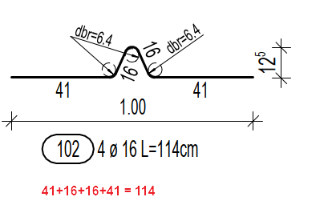
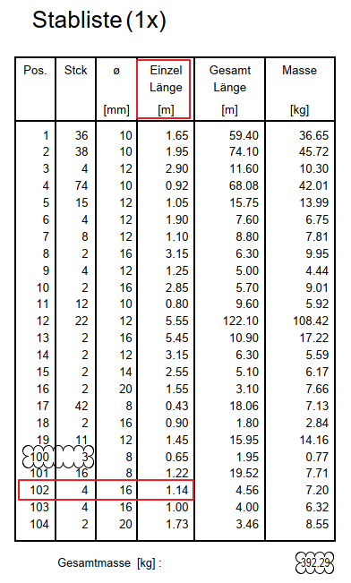

# Bar Length vs Schedule
> **Domain:** Bending & Schedule | **Check key:** `bar_length`

## Display Name

Bar Length vs Schedule

## Pass

PASS — all schema lengths match Einzel Länge in Stabliste.

## Not Found

NOT FOUND — schema total lengths or Einzel Länge values not visible.

## Description

Check each rebar schema to verify that the total length L is correct and match with Einzel Lange in Stabliste

Pos 102 = 41+16+16+41 = 114 (correct)

Example:

## Reference Images

## Check Prompt

CHECK — Bar Length vs Schedule (bar_length)
For each rebar schema where a total length L is explicitly shown, compare it with the "Einzel Länge" in the Stabliste.
Flag if the schema length clearly differs from the schedule value.
If the schema total length or Einzel Länge values are not explicitly shown, add "bar_length" to not_found.
