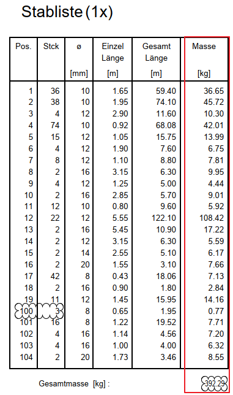
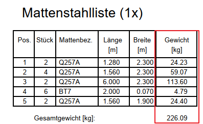

# Total Mass Arithmetic
> **Domain:** Bending & Schedule | **Check key:** `mass_arithmetic`

## Display Name

Total Mass Arithmetic

## Pass

PASS — sum of row masses matches Gesamtmasse footer.

## Not Found

NOT FOUND — Gesamtmasse footer absent or illegible.

## Description

Check whether the total mass in the Stabliste is correct.

Also Check mass for Mattenstahlliste if available

## Reference Images

## Check Prompt

CHECK — Total Mass Arithmetic (mass_arithmetic)
Verify that the Gesamtmasse (grand total mass) at the bottom of the Stabliste equals the sum
of all individual row Masse [kg] values.

PROCEDURE:
  1. Read every row's Masse [kg] value from the Stabliste.
  2. Sum them: computed_total = Σ Masse_i
  3. Read the Gesamtmasse [kg] footer value.
  4. If computed_total ≠ Gesamtmasse → flag immediately. Any difference is an error.

If the Mattenstahlliste is also present, apply the same check to it independently.

Do NOT flag if individual row values or the Gesamtmasse footer are not clearly readable.
If the Gesamtmasse footer is absent or illegible, add "mass_arithmetic" to not_found.
