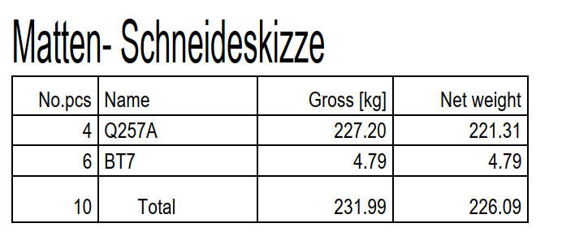

# Mesh-to-Total Mass Ratio
> **Domain:** Bending & Schedule | **Check key:** `mesh_ratio`

## Display Name

Mesh-to-Total Mass Ratio

## Pass

PASS — mesh reinforcement ratio >= 85 %.

## Not Found

NOT FOUND — Mattenstahlliste absent or Gesamtmasse totals not visible.

## Description

check that the ratio of used mesh reinforcement to the total reinforcement quantity is greater than 85%.

Ratio = (226.09/231.99)*100 = 97.46% Pass

## Reference Images

## Check Prompt

CHECK — Mesh-to-Total Mass Ratio (mesh_ratio)
This check requires BOTH Stabliste and Mattenstahlliste to be present on the sheet.
If both are present, calculate:
  ratio = (total_mesh_mass / (total_rebar_mass + total_mesh_mass)) × 100
Flag if ratio < 85 %.
Obtain totals from the "Gesamt" (total) rows of each schedule.
If either Stabliste or Mattenstahlliste is absent, or if the Gesamt totals are not clearly visible, add "mesh_ratio" to not_found.
