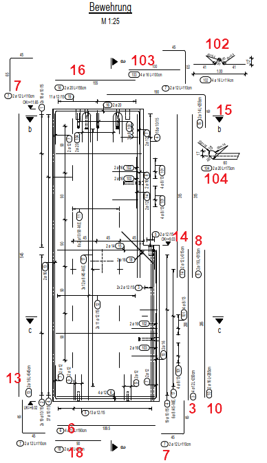
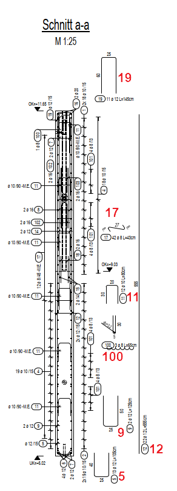
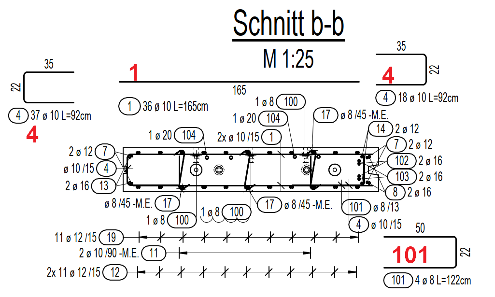
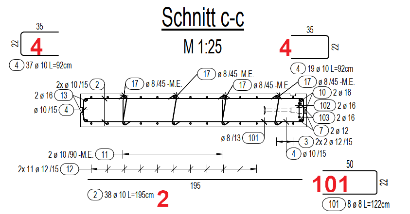

# Pos Coverage in Schemas
> **Domain:** Bending & Schedule | **Check key:** `pos_coverage`

## Display Name

Pos Coverage

## Pass

PASS — all Stabliste positions have a corresponding schema.

## Not Found

NOT FOUND — Stabliste not found on sheet.

## Description

Check the Bewehrung sections and their sub-sections and count the created rebar schemas.
Each rebar type in the Stabliste must be represented by at least one schema. At least one scheme is required in the Bewehrung sections or their sub-sections.

Example: in the Stabliste contains positions 1–19 and 100–104, each of these rebar positions must have at least one corresponding schema.

## Reference Images

## Check Prompt

CHECK — Pos Coverage in Schemas (pos_coverage)
Cross-reference every Pos number in the Stabliste with ALL representations visible anywhere on the sheet.

WHAT COUNTS AS COVERAGE FOR A POS — any of the following satisfies the requirement:
  A. A bar-shape sketch (bent or straight) shown in the margin or alongside a section view
     (Schnitt a-a, Schnitt b-b, Schnitt c-c, Bewehrung, etc.) with the Pos number adjacent.
     The sketch can be as simple as an L-shape, U-shape, or straight line segment.
  B. A bar annotation in any section or plan view that shows:
       Pos number  +  quantity × diameter  (e.g. "2 ø 12" or "4 × Ø8")
     Even without a separate drawn shape — if the Pos is labeled in a section with its bar
     dimensions, that counts as coverage.
  C. An annotation of the form  "n ø d / spacing"  or  "n ø d -M.E."  next to a position
     in any Schnitt or Bewehrung view — distributed and spacer bars are covered this way.
  D. A combined label like  "n × Ø d  L=xxx cm"  shown anywhere on the sheet adjacent to
     a bar representation, whether or not a formal schema box is drawn.
  E. A shared schema or note explicitly listing multiple Pos numbers covers ALL of them.

WHERE TO LOOK — search ALL of the following areas:
  • Left and right margin columns of every Schnitt section (a-a, b-b, c-c, etc.)
  • Top and bottom margin areas of every Schnitt section
  • The Bewehrung plan/elevation area — inline sketches with leader lines
  • Any Detail panels or callout boxes on the sheet
  • Dimension annotation areas around section cross-sections

PROCEDURE:
  1. List every Pos number from the Stabliste.
  2. Scan ALL areas listed above for any coverage representation (A–E) for each Pos.
  3. Only flag a Pos if you found absolutely NO coverage after searching the full sheet.

FLAG only if confidence ≥ 0.80 that coverage is genuinely absent from the ENTIRE sheet.
Do NOT flag if coverage might exist but is small, partially hidden, or hard to read.
