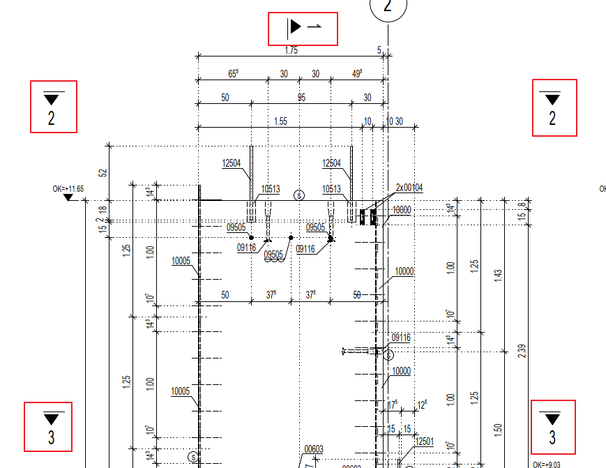

# Common Terminology
> Shared German/English glossary used across all QA checks.

## Glossary

Explaining terminology

Naming:

**Ansicht**: View / Elevation of formwork in technical drawings.

**Schnitt**: Section / Cross-section in technical drawings. Symbol of section is like this:

**Bewehrung**: Reinforcement / Rebar in construction drawings

**Draufsicht**= Top view / Plan view in technical drawings

**Stabliste**= Bar list / Rebar schedule in reinforcement drawings.

**Einbauteilliste (je Fertigteil)**= Embedded parts list/built in part list. This is the table summarizes the product need to place inside the precast element

**Montageteilliste (je Fertigteil)**= Assembly parts list (This is the table summarizes mounting part for each precast element).

**Wandansicht**= Wall elevation / Wall view.

**Lastausgleichsgehänge**= Load-balancing hanger / Suspension support.

**Title block**= The information panel on a technical drawing containing project details such as drawing title, number, scale, date, revision, and author. Spell check node

Mattenstahlliste is a table listing of mesh rebar

**Matten-Schneideskizze**= A drawing/sketch showing how reinforcement mesh is cut and shaped before installation.

## Reference Images

