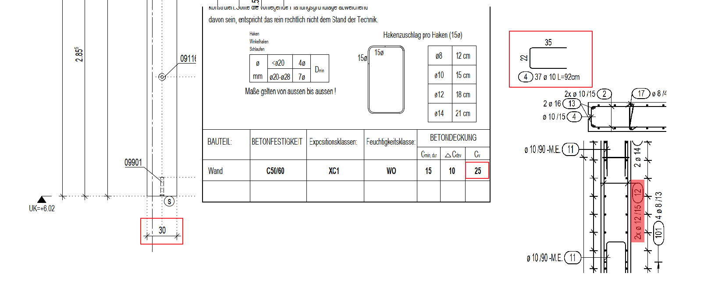

# Horizontal Pin Width
> **Domain:** Rebar Labels & Dims | **Check key:** `pin_width_horizontal`

## Display Name

Horizontal Pin Width

## Pass

PASS — all horizontal pin widths match wall_width – 2×Cv – 2×Ø_layer1.

## Not Found

NOT FOUND — wall thickness, Cv, outer rebar diameter, or labeled pin dimension not visible.

## Description

Horizontal pin = wall_width – 2*Cv – 2*Layer1 rebar diameter (round down)

Cv value in detail

A horizontal pin is a horizontally placed pin that is usually shown in the bottom cross-section of the Bewehrung. In this example, it is rebar position 4.

Layer1 rebar diameter detect the label in the side section of the wall (example is position 12)

Width_hor_pin = 30 – 2*2.5 – 2*1.2 = 22.6 ~ 22

## Reference Images

## Check Prompt

CHECK — Horizontal Pin Width (pin_width_horizontal)
IDENTIFICATION — locate horizontal pins using their bending schema:
  Horizontal pins are schematized in the BOTTOM / HORIZONTAL cross-section view of the Bewehrung
  (e.g. Schnitt b-b). In that view, the pin schema appears as a flat rectangular stirrup whose
  long dimension runs horizontally (wide and shallow). The width dimension labeled on that schema
  is the value to verify.

WIDTH FORMULA (use values from STEP A, not the illustration numbers):
  Required width = wall_width – 2 × Cv – 2 × Ø_layer1   (round down to nearest mm)
  [Formula illustration only — values are not from any real drawing]:
    e.g. if wall_width were 20 cm, Cv=2.0 cm, Ø_layer1=1.0 cm → 20 – 4.0 – 2.0 = 14 cm

Flag if the labeled horizontal pin width clearly differs from the calculated value.
If any required dimension (wall_width, Cv, Ø_layer1, or pin width) cannot be found, add "pin_width_horizontal" to not_found.
