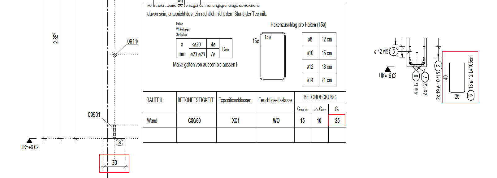

# Vertical Pin Width
> **Domain:** Rebar Labels & Dims | **Check key:** `pin_width_vertical`

## Display Name

Vertical Pin Width

## Pass

PASS — all vertical pin widths match wall_width – 2×Cv.

## Not Found

NOT FOUND — wall thickness, concrete cover (Cv), or labeled pin dimension not visible.

## Description

check the width of the horizontal and vertical pin reinforcement.

Vertical pin = wall_width – 2*Cv

Cv value in detail

A vertical pin is a vertically placed pin that is usually shown in the cross-section next to the Bewehrung. In this example, it is rebar position 5.

Width_ver_pin = 30 – 2*2.5 = 25

## Reference Images

## Check Prompt

CHECK — Vertical Pin Width (pin_width_vertical)
IDENTIFICATION — locate vertical pins using their bending schema:
  Vertical pins are schematized in the SIDE section view of the Bewehrung (e.g. Schnitt a-a).
  In that view, the pin schema appears as a narrow U-shape or rectangular stirrup whose long
  dimension runs vertically (tall and narrow). The width dimension labeled on that schema is
  the value to verify.

WIDTH FORMULA (use values from STEP A, not the illustration numbers):
  Required width = wall_width – 2 × Cv
  [Formula illustration only — values are not from any real drawing]:
    e.g. if wall_width were 20 cm and Cv were 2.0 cm → required = 20 – 4.0 = 16 cm

Flag if the labeled pin width clearly differs from the required calculated value.
If wall_width, Cv, or the labeled pin dimension cannot be found, add "pin_width_vertical" to not_found.
