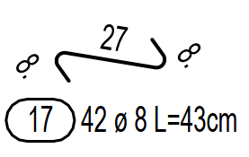
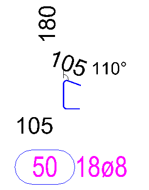
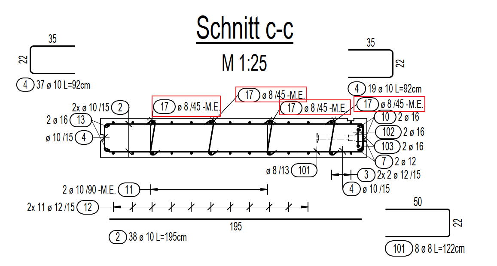

# Spacer / Clamp Label Suffix
> **Domain:** Rebar Labels & Dims | **Check key:** `spacer_label`

## Display Name

Spacer / Clamp Label Suffix

## Pass

PASS — all spacer and clamp labels include the "-M.E." suffix.

## Not Found

NOT FOUND — no "-M.E." labels found on sheet to identify spacer/clamp positions.

## Description

Check that the Spacers/Clamps reinforcement label includes the suffix “-M.E.” at the end. Only two types of this rebar is Spacers/Clamps reinforcement

## Reference Images

## Check Prompt

CHECK — Spacer / Clamp Label Suffix (spacer_label)
Use the "-M.E." suffix itself to identify which Pos numbers are spacers/clamps, then verify every
label for those positions also carries the suffix.

PROCEDURE — two steps:

  STEP 1 — Identify spacer/clamp positions:
    Scan the entire drawing for any label that ends with "-M.E." (e.g. "11-M.E.", "Ø8-M.E.", "Pos 17-M.E.").
    Extract the Pos number from each such label.  These are the spacer/clamp positions.
    Example: if you see "11-M.E." and "17-M.E.", then Pos 11 and Pos 17 are spacer/clamp positions.

  STEP 2 — Check ALL labels for each identified spacer/clamp Pos:
    For every Pos identified in Step 1, find every place in the drawing where that Pos is labeled
    (Stabliste rows, bending schemas, section callouts, Bewehrung annotations, dimension leaders, etc.).
    Flag any label of that Pos that does NOT end with "-M.E.".

EXAMPLE:
  Pos 11 is found labeled "11-M.E." in the schema → Pos 11 is a spacer.
  If "11" appears in the Stabliste or a section without the "-M.E." suffix → FAIL.
  If all occurrences of Pos 11 include "-M.E." → PASS for Pos 11.

Do NOT flag Pos numbers that never appear with "-M.E." anywhere — those are not spacers/clamps.
Do NOT flag if you cannot clearly read the label.
