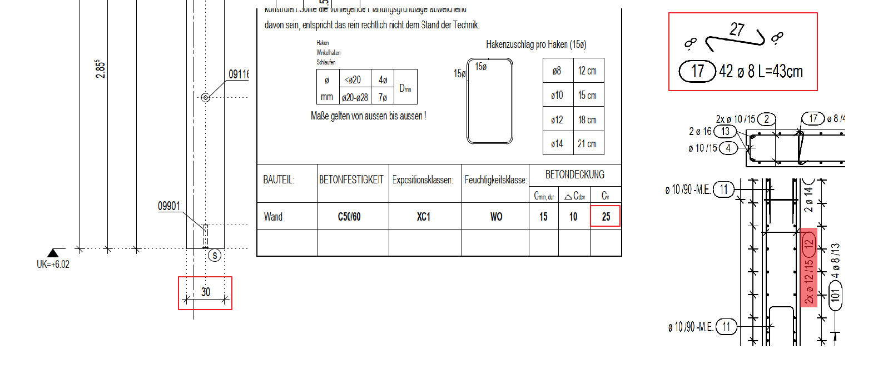

# Spacer / Clamp Width
> **Domain:** Rebar Labels & Dims | **Check key:** `spacer_width`

## Display Name

Spacer / Clamp Width

## Pass

PASS — all spacer/clamp widths match wall_width – 2×Cv + 2×Ø_spacer.

## Not Found

NOT FOUND — wall thickness, Cv, or spacer wire diameter not visible.

## Description

check the width of the Spacers/Clamps reinforcement.

Spacers/Clamps = wall_width – 2*Cv – 2*Spacer diameter (round up)

Cv value in detail

Layer1 rebar diameter detect the label in the side section of the wall (example is position 12)

Width_hor_pin = 30 – 2*2.5 + 2*0.8 = 26.6 ~ 27

## Reference Images

## Check Prompt

CHECK — Spacer / Clamp Width (spacer_width)
STEP 1 — Identify spacer/clamp positions:
  Only check Pos numbers that carry the "-M.E." suffix somewhere on the drawing
  (e.g. "ø 8/45 -M.E.", "17-M.E."). These are the spacer/clamp positions.
  Do NOT check any Pos that never appears with "-M.E." — those are regular rebar, not spacers.

STEP 2 — Verify width for each identified spacer/clamp Pos using values from STEP A:
  Required width = wall_width – 2 × Cv + 2 × Ø_spacer   (round up to nearest mm)
  where Ø_spacer = physical wire diameter of that spacer, read from its label (e.g. "ø 8" → 0.8 cm).
  [Formula illustration only — values are not from any real drawing]:
    e.g. if wall_width=20, Cv=2.0, Ø_spacer=0.6 → 20 – 4.0 + 1.2 = 17.2 → 18 cm

Flag ONLY if the labeled spacer/clamp width clearly differs from the calculated value.
If the declared width matches the calculated value → do NOT output any finding for that element.

NOT FOUND conditions — add "spacer_width" to not_found (do NOT silently pass) if ANY of:
  • No "-M.E." labels are visible anywhere on the sheet (no spacers/clamps to check)
  • wall_width cannot be read from the drawing
  • Cv cannot be read from the BETONDECKUNG table
  • Ø_spacer cannot be read from the spacer label
  • The spacer width dimension is not labeled on the bending schema
