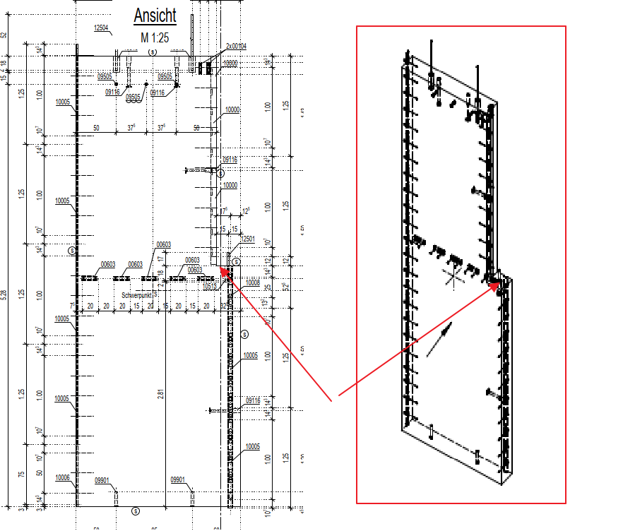

# 3D View Present
> **Domain:** Spelling & Title Block | **Check key:** `3d_view`

## Display Name

3D View Present

## Pass

PASS — 3D pictorial view present on sheet.

## Not Found

NOT FOUND — no 3D pictorial (oblique/isometric) view found on sheet.

## Description

Check that the wall has a 3D view included. The view of the wall in 45 degrees

## Reference Images

## Check Prompt

CHECK — 3D View Present (3d_view)
Check whether the sheet contains a 3D pictorial view of the wall element.

WHAT COUNTS AS A 3D VIEW — ANY ONE of the following is sufficient to pass:

  LABELED VIEWS (pass regardless of visual appearance):
  • Any area or view titled "3D Perspektive", "Perspektive", "isometrische Ansicht",
    "3D Ansicht", "3D View", or any text containing "3D" or "Perspektiv".

  UNLABELED VIEWS (visual recognition — no label required):
  • A drawing of the wall body shown from a diagonal/oblique angle (approximately 45°),
    where the wall appears as a solid rectangular block or slab tilted toward the viewer.
  • Telltale signs: the main face of the wall AND at least one side edge or top edge are
    visible simultaneously; the wall outline lines run diagonally (not purely horizontal
    or vertical); the view gives an overall "bird's eye" or "overview" impression of the
    entire wall element in three dimensions.

HOW TO SCAN:
  Look at ALL areas of the sheet, including corners and margins. If you see a rectangular
  wall-shaped outline drawn at a diagonal angle (showing depth), that IS the 3D view.

If ANY such view exists anywhere on the sheet → PASS immediately, do NOT flag.
If after scanning the entire sheet no such view exists → flag as an error.
