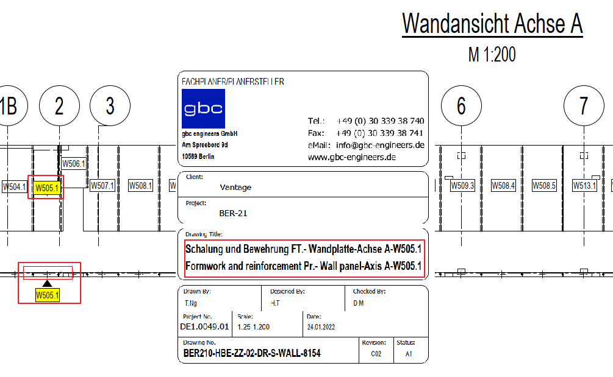

# Component Name vs Title Block
> **Domain:** Spelling & Title Block | **Check key:** `component_name`

## Display Name

Component Name vs Title Block

## Pass

PASS — Wandansicht component name matches title block.

## Not Found

NOT FOUND — Wandansicht element label or title block name not visible.

## Description

Check whether the component name on the Wandansicht matches the drawing name in the title block.

## Reference Images

## Check Prompt

CHECK — Component Name vs Title Block (component_name)
Verify the component/element name on the Wandansicht matches the drawing name in the title block.
Flag only where BOTH are visible and they clearly differ.
If only one of the two (Wandansicht label or title block name) is visible, add "component_name" to not_found.
