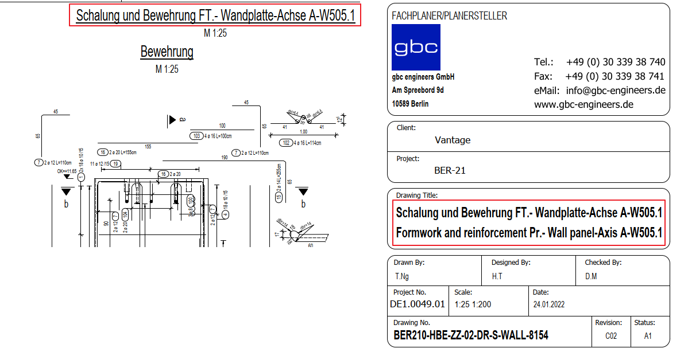

# Drawing Title vs Title Block
> **Domain:** Spelling & Title Block | **Check key:** `drawing_title`

## Display Name

Drawing Title vs Title Block

## Pass

PASS — Drawing Title matches the Title Block field in either German or English.

## Not Found

NOT FOUND — Drawing Title or Title Block field not visible in the drawing.

## Description

Check whether the Drawing Title matches the Title Block field in at least one language.

## Reference Images

## Check Prompt

CHECK — Drawing Title vs Title Block (drawing_title)
Find the Drawing Title field inside the title block (Schriftfeld / title block area, usually
in the lower-right corner of the sheet).
The field may contain a bilingual entry separated by "/" (e.g. "Schalung und Bewehrung ... /
Formwork and reinforcement ..."), or a single-language entry.

PASS if the Drawing Title matches the Title Block field in German OR in English.
If the field is bilingual, a match with either the German part (before "/") or the English part
(after "/") is sufficient to pass.
Minor punctuation differences (trailing period, dash spacing) are acceptable — flag only if the
semantic content clearly differs (e.g. different element name, wrong axis label).

If the Drawing Title field or the Title Block is not visible, add "drawing_title" to not_found.
