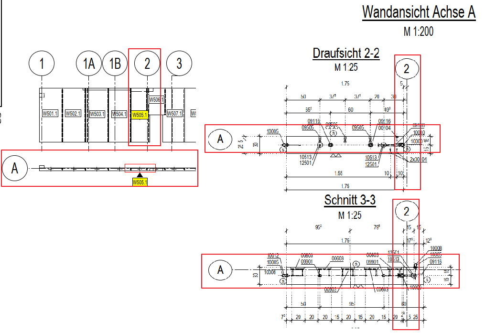

# Formwork Grid Lines Consistency
> **Domain:** Spelling & Title Block | **Check key:** `grid_lines`

## Display Name

Formwork Grid Lines Consistency

## Pass

PASS — grid lines in Schnitt views match Wandansicht.

## Not Found

NOT FOUND — Wandansicht absent from sheet.

## Description

Check whether the wall formwork Schnitt grid lines match the Wandansicht.

## Reference Images

## Check Prompt

CHECK — Formwork Grid Lines vs Wandansicht (grid_lines)
Check that grid lines (axis labels / column lines) in the wall formwork Schnitt views match those in the Wandansicht.
Flag any grid line present in the Schnitt but absent from the Wandansicht, or vice versa.
If no Wandansicht is visible on the sheet, add "grid_lines" to not_found.
