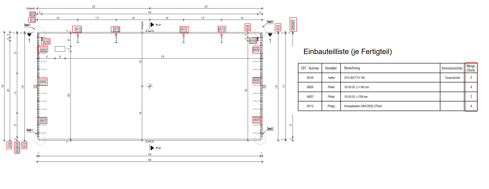

# Part Labels in Views
> **Domain:** Spelling & Title Block | **Check key:** `parts_labels`

## Display Name

Part Labels in Views

## Pass

PASS — all parts from present table(s) are labeled in section/elevation views.

## Not Found

NOT FOUND — no schedule tables (Einbauteilliste / Montageteilliste) visible on sheet.

## Description

The second presentation format: For the second presentation format, only check whether all built-in parts have labels.
For example, if there are 4 built-in parts in the drawing, then verify that all 4 labels number are shown in the section view.

## Reference Images

## Check Prompt

CHECK — Part Labels in Views (parts_labels)
Check that every part listed in any present table has an explicit label in the section/elevation views.
A drawing does NOT need both tables — check whichever table(s) are present.
If NEITHER table is present, add "parts_labels" to not_found and skip.

For Einbauteilliste (built-in parts / Einbauteile) — if this table is present:
  Count all built-in parts visible in Schnitt and Ansicht views.
  Verify each part has an explicit label (position number or designation) shown directly adjacent
  or via leader line. Flag any Einbauteil shown in the views without a label.

For Montageteilliste (mounting parts / Montageteile) — if this table is present:
  Count all mounting parts visible in Schnitt and Ansicht views.
  Verify each part has an explicit label shown directly adjacent or via leader line.
  Flag any Montageteil shown in the views without a label.
