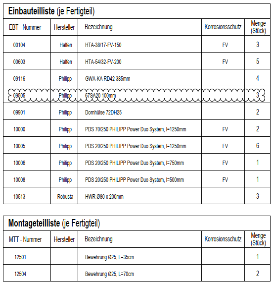

# Parts Lists Present
> **Domain:** Spelling & Title Block | **Check key:** `parts_lists`

## Display Name

Parts Lists Present

## Pass

PASS — Einbauteilliste and Montageteilliste both present.

## Not Found

NOT FOUND — neither Einbauteilliste nor Montageteilliste visible on sheet.

## Description

Check that the Built-in Parts List and Mounting Parts List are provided.

## Reference Images

## Check Prompt

CHECK — Parts Lists Present (parts_lists)
Verify the sheet contains both:
  • Einbauteilliste (embedded parts list)
  • Montageteilliste (assembly/mounting parts list)
Flag each table that is clearly absent from the sheet.

NOT FOUND conditions — add "parts_lists" to not_found (do NOT silently pass) if ANY of:
  • The area of the sheet where these lists would appear is not visible or not legible
  • The sheet is too low-resolution or illegible to determine whether these tables are present
  • Neither table can be confirmed present OR absent (cannot evaluate at all)
