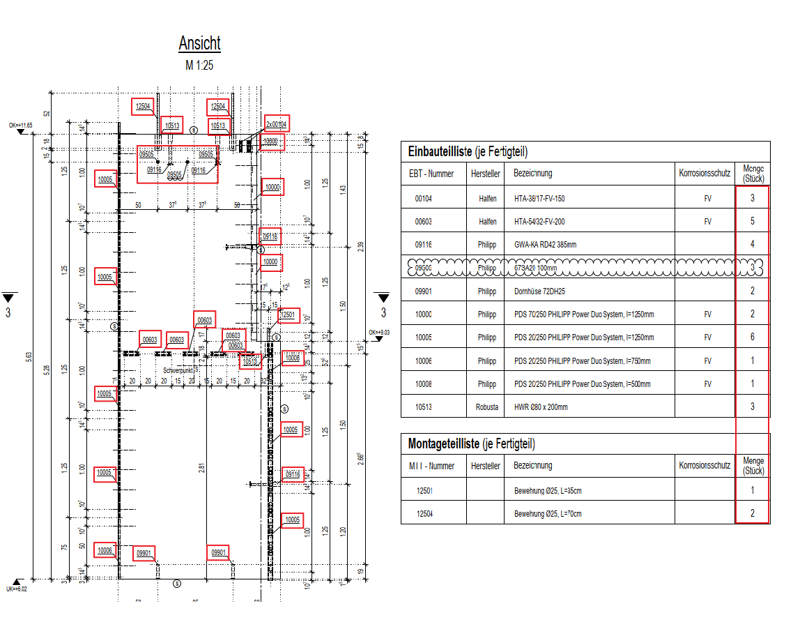

# Parts Label Consistency
> **Domain:** Spelling & Title Block | **Check key:** `parts_quantities`

## Display Name

Parts Label Consistency

## Pass

PASS — all part labels in views match the present schedule table(s).

## Not Found

NOT FOUND — no schedule tables (Einbauteilliste / Montageteilliste) visible on sheet.

## Description

Check whether the quantities of built-in parts and mounting parts in the Schnitt and Ansicht match the quantities in the schedules.

## Reference Images

## Check Prompt

CHECK — Parts Label Consistency (parts_quantities)
A drawing does NOT need to have both tables — check whichever table(s) are present.
If NEITHER Einbauteilliste NOR Montageteilliste is present, add "parts_quantities" to not_found and skip.

For each table that IS present, cross-reference every part label visible in Schnitt and Ansicht views
against that table:
  1. UNLABELED PARTS — any part belonging to a present table with NO label in the views. Flag each.
  2. LABEL NOT IN TABLE — any label code in the views that cannot be found in any present table. Flag each.
RULES:
  • A label found in ANY present table is consistent — do NOT flag it.
  • Do NOT flag rebar Pos numbers — only flag embedded/mounting part designations.
  • Only flag when you can clearly read the label AND confirm it is absent from all present tables.
  • If only Einbauteilliste is present, only cross-reference against Einbauteilliste.
  • If only Montageteilliste is present, only cross-reference against Montageteilliste.
