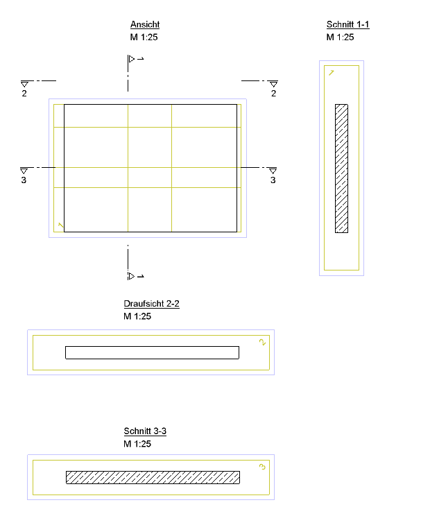
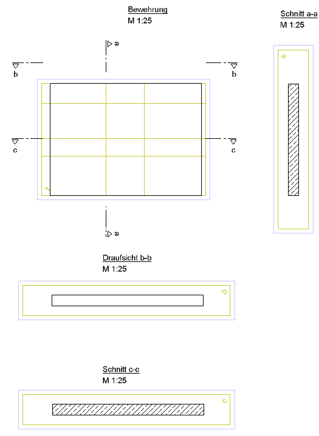

# Section Name Completeness
> **Domain:** Spelling & Title Block | **Check key:** `section_name`

## Display Name

Section Name Completeness

## Pass

PASS — all section cuts in Ansicht/Bewehrung have a corresponding Schnitt view.

## Not Found

NOT FOUND — no section cut designations found in Ansicht or Bewehrung.

## Description

Check whether the section names are correct.
For example, if sections 1-1, 2-2, and 3-3 are shown in the Ansicht or Bewehrung, the corresponding sections Schnitt 1-1, Schnitt 2-2, and Schnitt 3-3 must all be provided.

## Reference Images

## Check Prompt

CHECK — Section Name Completeness (section_name)
Identify all section cut designations called out in the Ansicht or Bewehrung (e.g. "1-1", "2-2", "3-3").
Verify that a corresponding view with the same designation number is present on the sheet.
A view satisfies the requirement if it is labeled "Schnitt X-X", "Draufsicht X-X", or any other
view type (top view, cross-section, detail) that carries the same designation number X-X.
Flag only if NO view of any type with that designation number exists anywhere on the sheet.
Do NOT flag if the view exists but is located elsewhere on the sheet.
