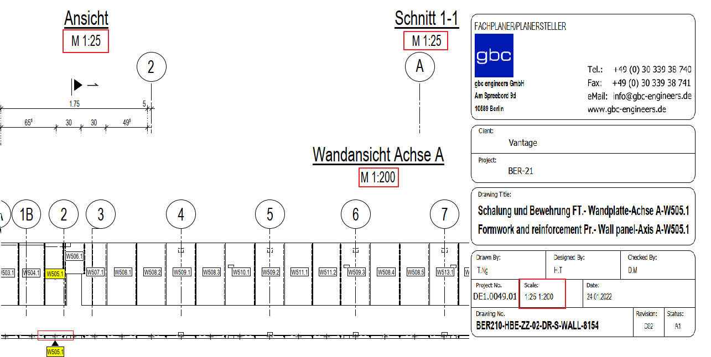

# Scale Consistency
> **Domain:** Spelling & Title Block | **Check key:** `section_scale`

## Display Name

Scale Consistency

## Pass

PASS — all view scales consistent with title block.

## Not Found

NOT FOUND — no scale labels (M 1:XX) visible on views or title block.

## Description

Check whether the drawing scales match the title block.
If any scale in the drawing (section, detail…) differs from the title block, report it as FAIL and update the title block accordingly.

## Reference Images

## Check Prompt

CHECK — Scale Consistency (section_scale)
Compare every explicit scale label (M 1:XX) on views or sections against the title block scale.
Flag any view whose labeled scale clearly differs from the title block value.
Only flag where both scales are simultaneously visible and unambiguously different.
